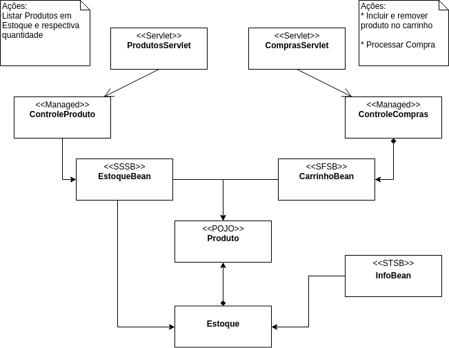

## Trabalho 01

Você deverá construir uma aplicação para controle de uma loja virtual de produtos. Na versão 01 da loja, você deverá implementar um controle de estoque simples e um carrinho de compras. A figura abaixo descreve algumas das estruturas envolvidas:

Atenção aos seguintes pontos:

* O diagrama de classes está intencionalmente incompleto para que vocês complementar com classes, interfaces e outras estruturas que acharem necessário;

* Cheque os estereótipos e as siglas correspondentes a Stateless, Stateful e Singleton Session Beans;

* Lembre-se das ações mínimas exigidas no diagrama. Você não precisa se ater somente a elas.

### Entrega

O trabalho 01 vale 2pts e deverá ser entregue até às 23h59m59s de 22/04/2019. Após essa data, o trabalho passará a valer 1,5pts.

Para realizar a entrega vocẽ deverá:

* Marcar o seu repositório com a tag _trab01_;
* Atualizar o arquivo _loja-virtual.md_ conforme as informações pedidas.   